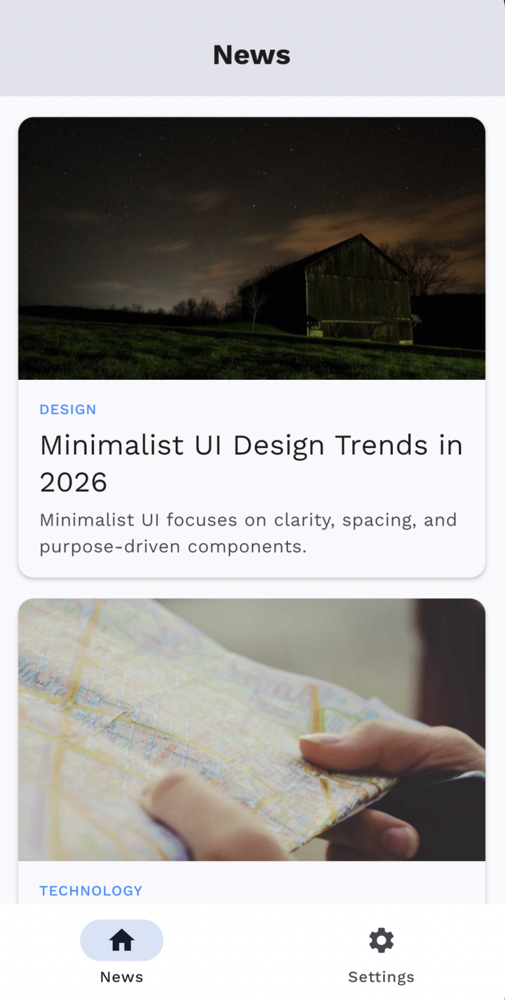
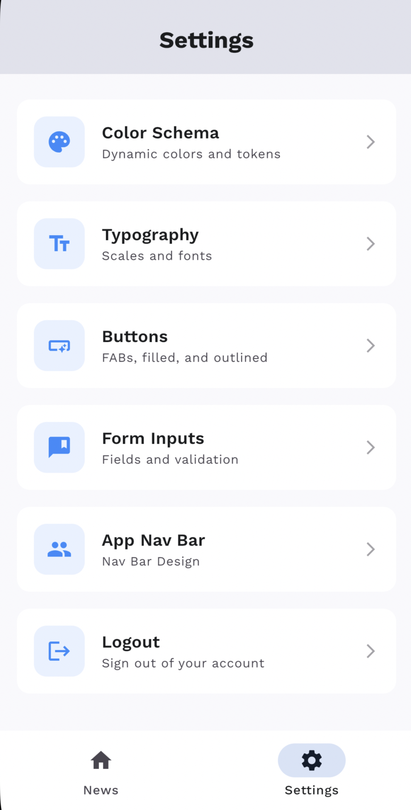
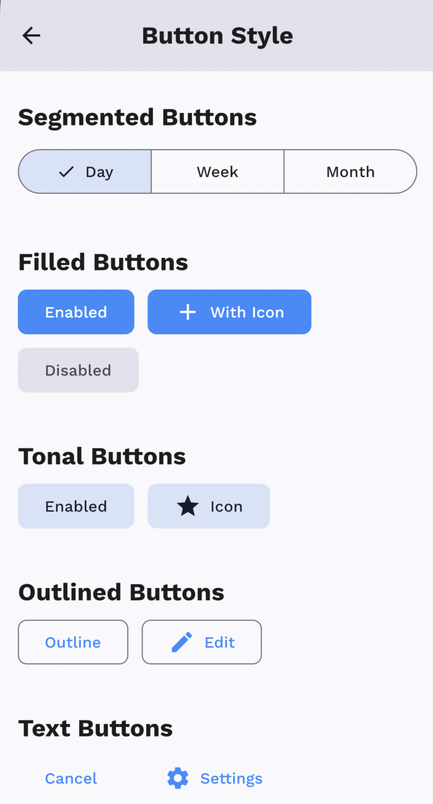

# KMP Boilerplate 🚀

A production-ready **Kotlin Multiplatform** boilerplate with Clean Architecture, Atomic Design System, and an AI-powered agent workflow system built on top of [Antigravity](https://antigravity.dev).

> This project serves two purposes:
> 1. **Ready-to-use CMP starter** — clone it and start building your app.
> 2. **AI Context Engineering playground** — learn how to use Rules, Skills, and Workflows to make AI work the way *you* want.

---

## Table of Contents

- [Overview](#1-overview)
- [Features](#2-features)
- [AI Workflow](#3-ai-workflow)
- [Tech Stack](#4-tech-stack)
- [Architecture Overview](#5-architecture-overview)
- [Setup](#6-setup)
- [Design Decisions](#7-design-decisions)
- [Contact & License](#8-contact--license)

---

## 1. Overview

KMP Boilerplate is a personal reference project for building **Compose Multiplatform** apps targeting **Android and iOS**. It bakes in the patterns, tools, and guardrails that make a project maintainable from day one — so the next project starts on solid ground.

The project is also used to explore **AI Context Engineering**: the practice of writing structured context (rules, skills, workflows) that guides AI coding assistants to follow your architecture without constant supervision.

---

## 📸 Screenshots

| News Feed | Settings | Button Demo |
|:---:|:---:|:---:|
|  |  |  |

---

## 2. Features

| Category | What's included |
|---|---|
| 🎨 **Atomic Design** | Full token-based design system: `Spacing`, `Dimens`, `Color`, `Typography` helpers |
| 🧩 **Core Component Library** | `CoreButton`, `CoreTextInput`, `CoreTopAppBar`, `CorePickers`, etc. |
| 🏗️ **Clean Architecture** | Feature-First: Domain → Data → UI with strict dependency rules |
| 🤖 **AI Agent System** | Rules, Skills, Workflows for Antigravity-powered development |
| 🔒 **Security Rules** | Built-in AI rules for encrypted storage, HTTPS, input validation |
| 🧪 **TDD Enforced** | UseCase and Repository tests written before implementation |
| 💉 **Koin DI** | Platform-aware dependency injection (Android, iOS, Desktop) |
| 📡 **Networking** | Ktor with `BaseResponse<T>` wrapper and `ApiErrorHandler` |
| 🗄️ **Local Storage** | Room (KMP) for database + DataStore for preferences |

### Implemented Features

<details>
<summary>🔐 Authentication (Onboarding)</summary>

- Login screen with email & password validation
- Password hashed (MD5) before sending to API
- Auth token stored securely via platform `SecureStorage`
- Auto-redirect: authenticated → Dashboard, unauthenticated → Login
- Use Cases: `LoginUseCase`, `LogoutUseCase`, `CheckLoginStatusUseCase`, `ValidateEmailUseCase`, `ValidatePasswordUseCase`

</details>

<details>
<summary>📰 News Feed with Pagination</summary>


- Offline-first article list using Room as source of truth
- Limit-based pagination with `LoadMoreNewsUseCase`
- Cache expiry check via `CheckCacheExpiredUseCase`
- Pull-to-refresh with `RefreshNewsFeedUseCase`
- Empty, error, and loading states handled

</details>

<details>
<summary>📄 Article Detail</summary>

- Full article detail screen fetched by article ID
- Remote fetch with local cache fallback
- Use Cases: `GetNewsDetailUseCase`, `RefreshNewsDetailUseCase`

</details>

<details>
<summary>🎨 Design System Demo (Settings)</summary>

| Settings Menu | Button Styles |
|:---:|:---:|
|  |  |

Interactive screens for exploring the design system:
- **Color** — full color palette preview
- **Typography** — all text styles rendered
- **Buttons** — every `CoreButton` variant
- **Forms** — `CoreTextInput`, `CorePickers`, selection controls
- **Navbar** — `CoreTopAppBar` variants

</details>

---

## 3. AI Workflow

This is the most unique part of this boilerplate. It uses an AI agent system (Antigravity) configured with three layers of context.

### Mental Model

```
📖 Rules      →  Always active. The AI's "team handbook".
🎯 Skills     →  Activated per task. The AI's "SOPs".
📋 Workflows  →  Triggered by /command. The AI's "project process".
```

```
User Request ──► /workflow ──► triggers Skills
                    │
                    └──► Rules (always applied in background)
```

### Rules (`.agent/rules/`) — Always Active

| File | Purpose |
|---|---|
| `project_architecture.md` | Feature-First structure & dependency rules |
| `coding_standards.md` | Naming, error handling, API response patterns |
| `design_system.md` | Enforce token usage, forbid hardcoded values |
| `tech_stack.md` | Approved library list |
| `dependency_injection.md` | Koin module registration patterns |
| `security.md` | Security checklist for all generated Kotlin code |
| `testing_qa.md` | TDD structure, fake naming conventions |
| `ui_navigation.md` | Type-safe Compose Navigation rules |

### Skills (`.agent/skills/`) — Activated Contextually

| Skill | When it activates |
|---|---|
| `clarify_requirements` | Before any new feature |
| `tdd_implementation` | Domain & Data implementation |
| `data_implementation` | Repository & Data Source creation |
| `usecase_implementation` | UseCase creation |
| `viewmodel_implementation` | ViewModel & MVI pattern |
| `ui_implementation` | Any Compose UI code |
| `ui_validation` | After every UI component |
| `ui_wireframe_interview` | Before UI spec creation |
| `compose_navigation` | Adding screens or deep links |
| `coroutine_skill` | Async / Flow code |
| `repository_testing` | Repository test creation |
| `viewmodel_testing` | ViewModel test creation |
| `documentation_maintenance` | After architecture changes |
| `resource_management` | Adding strings, images, fonts |

### Workflows (`.agent/workflows/`) — Triggered by Command

#### `/implement_feature` — 5-session phased delivery
```
Session 1:  /implement_feature "Add profile screen"
            → clarify_requirements asks key questions
            → Creates domain-plan.md, data-plan.md, ui-plan.md

Session 2:  Implement Domain layer (TDD: failing test → pass)
Session 3:  Implement Data layer (CQS pattern enforced)
Session 4:  ViewModel + State (MVI pattern)
Session 5:  Components → ui_validation scan → Navigation wiring
```

#### `/quick_fix` — Lightweight, under 30 min
```
/quick_fix "Login button stays disabled after error"
→ Root cause: loading state not reset on error
→ Fix: _uiState.update { it.copy(isLoading = false) }
→ Tests pass ✅
```

#### `/retrospective` — Daily improvement report
```
/retrospective
→ Reviews today's sessions
→ Reports: what went well, gaps found, improvement recommendations
```

---

## 4. Tech Stack

| Library | Version | Purpose |
|---|---|---|
| [Kotlin Multiplatform](https://kotlinlang.org/docs/multiplatform.html) | `2.2.10` | Shared logic & UI across platforms |
| [Compose Multiplatform](https://www.jetbrains.com/compose-multiplatform/) | `1.10.0` | Declarative UI for Android & iOS |
| [Koin](https://insert-koin.io/) | `4.1.1` | Dependency injection (KMP-native) |
| [Ktor](https://ktor.io/) | `3.0.3` | Multiplatform HTTP client |
| [Room (KMP)](https://developer.android.com/kotlin/multiplatform/room) | `2.7.0` | Local database with compile-time verification |
| [DataStore](https://developer.android.com/topic/libraries/architecture/datastore) | `1.1.2` | Key-value preferences |
| [Navigation Compose (KMP)](https://www.jetbrains.com/compose-multiplatform/) | `2.9.1` | Type-safe multiplatform navigation |
| [Kotlinx Coroutines](https://github.com/Kotlin/kotlinx.coroutines) | `1.10.1` | Structured concurrency & Flow |
| [Kotlinx DateTime](https://github.com/Kotlin/kotlinx-datetime) | `0.6.1` | Multiplatform date/time |
| [Kotlinx Serialization](https://github.com/Kotlin/kotlinx.serialization) | `1.8.0` | JSON serialization |
| [Coil 3](https://coil-kt.github.io/coil/) | `3.1.0` | Multiplatform image loading |
| [Multiplatform Settings](https://github.com/russhwolf/multiplatform-settings) | `1.2.0` | Secure key-value storage |
| Gradle Version Catalogs | — | Centralized dependency management |

---

## 5. Architecture Overview

Feature-First Clean Architecture — each feature is self-contained.

```
composeApp/src/commonMain/kotlin/
├── core/                          # Shared infrastructure
│   ├── data/remote/               # Ktor base client, ApiErrorHandler
│   ├── data/local/                # Room DB, DataStore
│   ├── domain/model/              # Result<T>, AppException
│   ├── theme/                     # Colors, Typography, Spacing tokens
│   └── components/                # CoreButton, CoreTextInput, etc.
│
└── feature/
    ├── onboarding/                # 🔐 Authentication
    │   ├── domain/usecase/        # Login, Logout, Validate, CheckStatus
    │   ├── data/                  # AuthApi, SecureStorage, AuthRepositoryImpl
    │   └── ui/                    # LoginScreen, LoginViewModel
    │
    ├── news/                      # 📰 News Feed + Article Detail
    │   ├── domain/usecase/
    │   │   ├── newsfeed/          # GetNewsFeed, RefreshNewsFeed, LoadMore, CheckCache
    │   │   └── newsdetail/        # GetNewsDetail, RefreshNewsDetail
    │   ├── data/                  # NewsApi, Room DAO, NewsRepositoryImpl
    │   └── ui/
    │       ├── main/              # NewsScreen, NewsFeedViewModel
    │       └── detail/            # NewsDetailScreen, components/
    │
    ├── settings/                  # 🎨 Design System Demo
    │   ├── domain/usecase/        # GetSettingsUseCase
    │   └── ui/                    # ColorScreen, TypographyScreen, ButtonScreen, FormScreen
    │
    └── dashboard/                 # 🏠 Bottom Nav Host
        └── ui/                    # DashboardScreen (News + Settings tabs)
```

**Dependency rule:** `UI → Domain ← Data`. Features never import from each other.

---

## 6. Setup

### Prerequisites

Make sure your environment meets the **exact versions** this project is built with:

| Tool | Required Version |
|---|---|
| **Gradle Wrapper** | `8.14.3` (auto-applied via `gradlew`) |
| **Android Gradle Plugin (AGP)** | `8.7.3` |
| **Kotlin** | `2.2.10` |
| **KSP** | `2.2.10-2.0.2` |
| **Compose Multiplatform** | `1.10.0` |
| **Android compile SDK** | `35` |
| **Android min SDK** | `24` |
| **JDK** | `17+` |
| **Android Studio** | Ladybug or later (supports AGP 8.7+) |
| **Xcode** | `15+` (for iOS target) |

> ⚠️ **Gradle version matters.** This project uses Gradle `8.14.3` which requires JDK 17 minimum. If you see build errors, make sure your `JAVA_HOME` points to JDK 17+.

### Navigation Library

This project uses **Jetpack Navigation Compose (KMP version)** — not the standard Android-only Navigation:

```toml
# gradle/libs.versions.toml
navigation-compose = "2.9.1"
androidx-navigation-compose = { module = "org.jetbrains.androidx.navigation:navigation-compose" }
```

> ⚠️ Make sure to use `org.jetbrains.androidx.navigation:navigation-compose` (multiplatform), **not** `androidx.navigation:navigation-compose` (Android-only). Using the wrong artifact will cause iOS build failures.

### Clone & Run

```bash
git clone https://github.com/FrenskyOey/KMP_Boiler.git
cd KMP_Boiler
```

**Android:**
```bash
./gradlew :composeApp:assembleDebug
```

**iOS:**
Open `/iosApp` in Xcode and press Run, or build from terminal:
```bash
./gradlew :composeApp:iosSimulatorArm64Test
```

### Using as AI Boilerplate

The `.agent/` directory is ready to use with [Antigravity](https://antigravity.dev). No additional setup needed — rules are automatically loaded per session.

---

## 7. Design Decisions

| Decision | Rationale |
|---|---|
| **Single Gradle module** | Simpler KMP setup; logical boundaries enforced by package discipline and AI rules |
| **Koin over Hilt** | Hilt is Android-only; Koin has native KMP support |
| **CQS Repository pattern** | Separates `Flow` observation (query) from `suspend` fetching (command) to prevent redundant network calls |
| **Atomic Design tokens** | Prevents design drift; AI rules auto-reject hardcoded dp/color values |
| **Room over SQLDelight** | Official JetBrains/Google KMP support; familiar API for Android developers |
| **Feature-First over Layer-First** | Scales better; features can be added/removed without touching other features |
| **Session-based AI workflow** | Prevents context overload; each session has a single focused responsibility |

---

## 8. Contact & License

**Author:** Frensky Oey
**GitHub:** [FrenskyOey](https://github.com/FrenskyOey)

This project is open source and available under the [MIT License](LICENSE).

> Built with ☕ and the goal of never writing the same boilerplate twice.