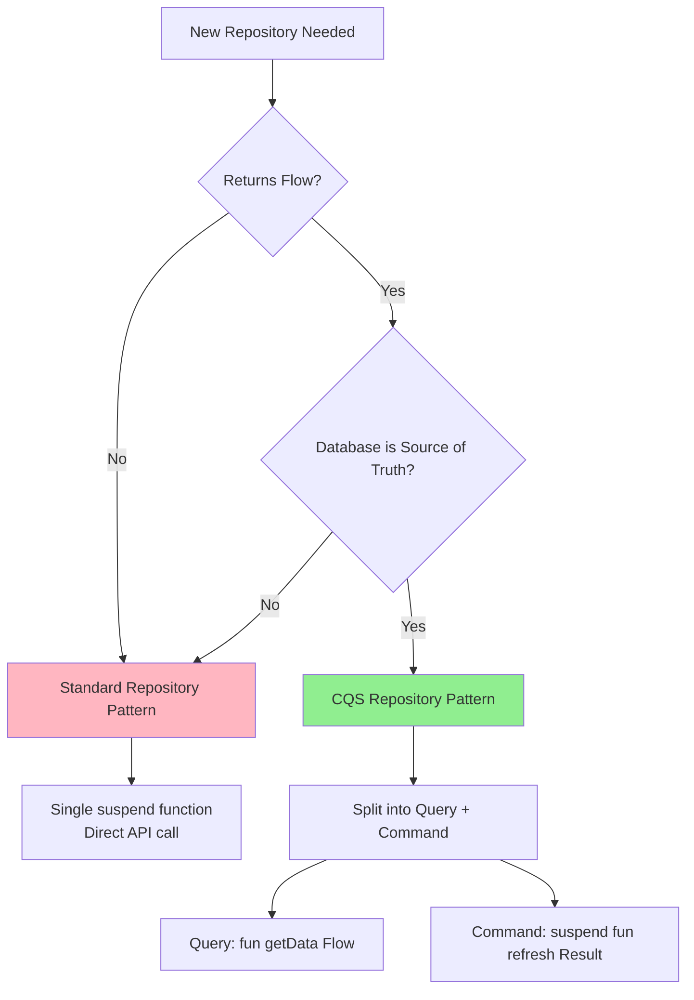

# CQS Repository Pattern - Quick Reference

## Decision Flowchart



## Pattern Comparison

| Aspect | CQS Pattern | Standard Pattern |
|--------|-------------|------------------|
| **Use Case** | DB as source of truth | Direct API call |
| **Return Type** | `Flow<Data?>` + `Result<Unit>` | `Result<Data>` |
| **Network Calls** | Explicit (Command) | Every invocation |
| **Observation** | Cheap (local only) | N/A |
| **Examples** | News Detail, Profile | Login, Submit |

## Implementation Checklist

### CQS Pattern
- [ ] Repository returns `Flow<Data?>` for observation
- [ ] Repository has `suspend fun refresh(): Result<Unit>`
- [ ] Create separate UseCases (Get + Refresh)
- [ ] Query only reads from local database
- [ ] Command fetches from network, updates local
- [ ] Test Query and Command separately

### Standard Pattern
- [ ] Repository returns `Result<Data>`
- [ ] Single suspend function
- [ ] Direct API call, no local storage
- [ ] One UseCase wrapping repository call

## Common Mistakes

### ❌ Don't Do This

```kotlin
// Mixing observation with side effects
fun getData(): Flow<Result<Data>> = channelFlow {
    // Network call on EVERY collection!
    val response = api.getData()
    emit(Result.Success(response))
}
```

### ✅ Do This Instead

```kotlin
// Separate observation from action
fun getData(): Flow<Data?> = localDb.getData()
suspend fun refreshData(): Result<Unit> = fetchAndStore()
```

## Test Naming Convention

```
Pattern: Fake[Operation][Feature]Repository

Examples:
- FakeGetNewsDetailRepository
- FakeRefreshNewsDetailRepository
- FakeLoginRepository
```

## Quick Code Templates

### CQS Repository Interface
```kotlin
interface [Feature]Repository {
    fun get[Feature](id: Int): Flow<[Feature]?>
    suspend fun refresh[Feature](id: Int): Result<Unit>
}
```

### CQS Repository Implementation
```kotlin
class [Feature]RepositoryImpl : [Feature]Repository {
    override fun get[Feature](id: Int) = 
        localDataSource.get[Feature](id).map { it?.toDomain() }
    
    override suspend fun refresh[Feature](id: Int) = try {
        val response = remoteDataSource.get[Feature](id)
        localDataSource.upsert(response.toEntity())
        Result.Success(Unit)
    } catch (e: Exception) {
        Result.Error(handleError(e))
    }
}
```

### Standard Repository
```kotlin
interface [Feature]Repository {
    suspend fun [action](...): Result<[Data]>
}

class [Feature]RepositoryImpl : [Feature]Repository {
    override suspend fun [action](...) = try {
        val response = remoteDataSource.[action](...)
        Result.Success(response.toDomain())
    } catch (e: Exception) {
        Result.Error(handleError(e))
    }
}
```
