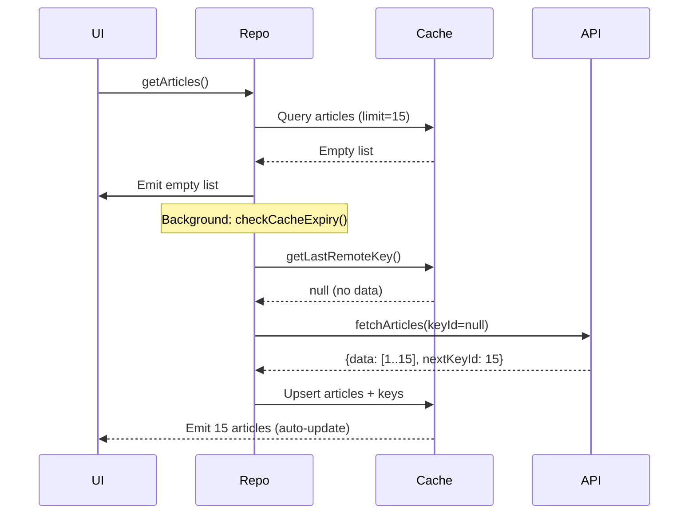
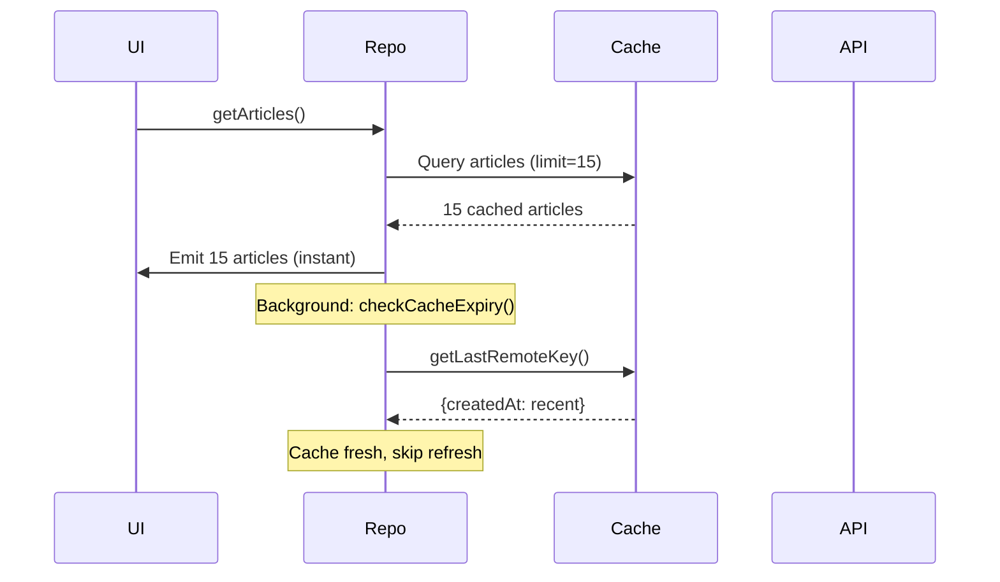
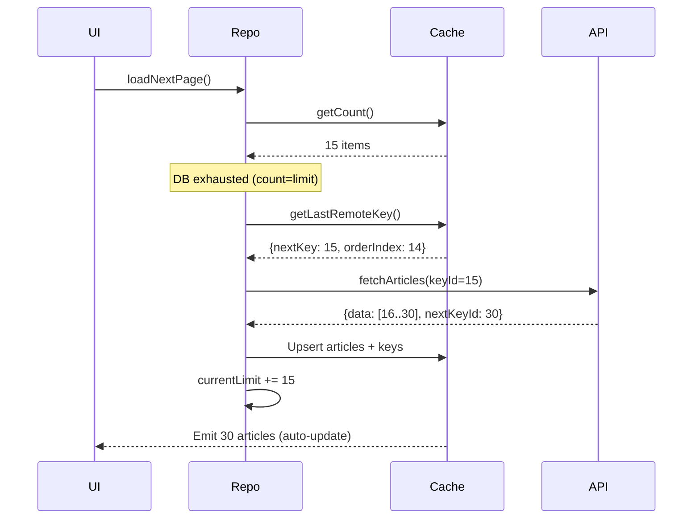

# Offline-First Pagination Guide

This guide documents the offline-first pagination pattern implemented in the News Feed feature. Use this as a reference when implementing similar pagination in other features.

---

## Overview

This pattern provides:
- **Offline-First**: Data loads instantly from local cache
- **Key-Based Pagination**: Server-driven pagination using `nextKeyId`
- **Stale-While-Revalidate**: Shows cached data immediately while refreshing in background
- **Smart Invalidation**: Preserves cache when possible, clears only when data chain breaks
- **Manual Limit Control**: Efficient pagination without Paging 3 library

---

## Architecture Components

### 1. Database Entities

#### ArticleEntity
```kotlin
@Entity(tableName = "articles")
data class ArticleEntity(
    @PrimaryKey val id: Long,
    val title: String,
    val content: String,
    val imageUrl: String,
    val topic: String,
    val createdAt: Long  // Timestamp for cache expiry
)
```

#### NewsRemoteKeysEntity
```kotlin
@Entity(tableName = "news_remote_keys")
data class NewsRemoteKeysEntity(
    @PrimaryKey val articleId: Long,
    val prevKey: Int?,
    val nextKey: Int?,
    val createdAt: Long,
    val orderIndex: Int,           // Preserves API order (1-based)
    val isEndReached: Boolean = false  // true only on last article of last page
)
```

**Why Remote Keys?**
- Tracks pagination state per item
- Maintains correct order from API via `orderIndex`
- `isEndReached` stored per-article enables accurate end detection by position
- Enables smart cache invalidation

### 2. API Response

```kotlin
@Serializable
data class BaseListResponse<T>(
    val data: List<T>?,
    val isSuccess: Boolean,
    val errorMessage: String?,
    val pagination: Pagination?
)

@Serializable
data class Pagination(
    @SerialName("next_key_id") val nextKey: Int?,
    @SerialName("has_next") val hasNext: Boolean  // false = end of list
)
```

### 3. Repository Pattern

```kotlin
interface NewsFeedRepository {
    fun getArticles(): Flow<List<Article>>             // Query: observe cache
    suspend fun refresh(): Result<PaginationInfo>      // Command: refresh first page
    suspend fun loadNextPage(): Result<PaginationInfo> // Command: load more
    suspend fun isCacheExpired(): Boolean              // Query: check cache freshness
}

data class PaginationInfo(
    val hasEndReached: Boolean,
    val currentLimit: Int
)
```

---

## Implementation Flow

### Initial Load (First Time)



### Subsequent Load (Cache Hit)



### Load Next Page



---

## Key Mechanisms

### 1. Pure Flow — No Side Effects

The `getArticles()` Flow is a **pure query** — it never triggers network calls or refreshes. Cache checking is an explicit ViewModel intent (UDF).

```kotlin
// Repository: pure query
override fun getArticles(): Flow<List<Article>> {
    return currentLimit.flatMapLatest { limit ->
        localDataSource.getArticles(limit).map { entities ->
            entities.map { it.toDomain() }
        }
    }
}

// Repository: separate cache check method
override suspend fun isCacheExpired(): Boolean {
    val lastKey = localDataSource.getLastRemoteKey() ?: return true
    val timeout = 60 * 60 * 1000L // 1 hour
    return (Clock.System.now().toEpochMilliseconds() - lastKey.createdAt > timeout)
}
```

```kotlin
// ViewModel: cache check is an explicit intent
NewsIntent.CheckExpired -> checkCacheAndRefreshIfNeeded()

private fun checkCacheAndRefreshIfNeeded() {
    viewModelScope.launch {
        val isExpired = getNewsFeedUseCase.isCacheExpired()
        if (_uiState.value.articles.isEmpty() || isExpired) refresh()
    }
}
```

**Why no auto-refresh in Flow?** Hiding a network call inside a Flow (query) violates UDF and causes race conditions — the Flow emits while a concurrent `loadNextPage()` is also running.

### 2. Smart Invalidation

```kotlin
override suspend fun refresh(): Result<PaginationInfo> {
    val response = remoteDataSource.fetchArticles(keyId = null)

    if (response.isSuccess && response.data != null) {
        val firstId = response.data.first().id
        val firstKey = localDataSource.getRemoteKeys(firstId)
        val isSameChain = firstKey?.nextKey == response.pagination?.nextKey

        if (!isSameChain) {
            localDataSource.clearRemoteKeys()  // Reset pagination chain
        }

        localDataSource.upsertArticles(articles)
        localDataSource.upsertRemoteKeys(keys)
        currentLimit.value = 15  // Reset limit on refresh
    }
    return Result.Success(PaginationInfo(hasEndReached = false, currentLimit = currentLimit.value))
}
```

> **Note**: Room KMP DAO operations with `OnConflictStrategy.REPLACE` are already atomic. No manual transaction wrapper is needed.

**Why Clear Keys Only?**
- Articles are upserted (replaced if ID exists)
- Keys determine pagination state — clearing them resets pagination without losing article data

### 3. Efficient Pagination with Accurate End Detection

```kotlin
override suspend fun loadNextPage(): Result<PaginationInfo> {
    val limit = currentLimit.value
    val dbCount = localDataSource.getCount()

    // Case 1: DB has more cached data — just increase limit (instant, no API call)
    if (dbCount > limit) {
        currentLimit.value += 15

        // Check isEndReached at the NEW limit position using orderIndex
        // ⚠️ Do NOT use getLastRemoteKey() — it checks the last article in DB,
        // not the article at the current visible limit position.
        val keyAtLimit = localDataSource.getRemoteKeyByOrderIndex(currentLimit.value)
        return Result.Success(
            PaginationInfo(
                hasEndReached = keyAtLimit?.isEndReached ?: false,
                currentLimit = currentLimit.value
            )
        )
    }

    // Case 2: DB exhausted — fetch from API
    val lastRemoteKey = localDataSource.getLastRemoteKey()
    val nextKey = lastRemoteKey?.nextKey

    if (lastRemoteKey?.isEndReached == true || nextKey == null) {
        return Result.Success(PaginationInfo(hasEndReached = true, currentLimit = currentLimit.value))
    }

    val response = remoteDataSource.fetchArticles(keyId = nextKey)
    val hasEndReached = response.pagination?.hasNext == false
    // ... upsert articles + remote keys (isEndReached = true on last article only)
    currentLimit.value += 15
    return Result.Success(PaginationInfo(hasEndReached = hasEndReached, currentLimit = currentLimit.value))
}
```

**Key insight — `currentLimit` ↔ `orderIndex`**: `currentLimit` directly maps to `orderIndex`. After incrementing, `getRemoteKeyByOrderIndex(currentLimit.value)` fetches the key for the last *visible* article — giving the correct `isEndReached` for the user's current scroll position.

```kotlin
// Required DAO query
@Query("SELECT * FROM news_remote_keys WHERE orderIndex = :orderIndex LIMIT 1")
suspend fun getRemoteKeyByOrderIndex(orderIndex: Int): NewsRemoteKeysEntity?
```

---

## Use Cases

### Use Case 1: Normal Pagination

**Scenario:** User scrolls through news feed

1. **Initial Load**
   - User opens app
   - `getArticles()` emits 15 cached articles instantly
   - Background: `checkCacheExpiry()` refreshes if >1 hour old

2. **Scroll to Bottom**
   - UI calls `loadNextPage()`
   - Repository checks: DB has 15, limit is 15 → fetch from API
   - Fetches articles 16-30 using `nextKeyId: 15`
   - Increases limit to 30
   - Flow emits 30 articles

3. **Continue Scrolling**
   - UI calls `loadNextPage()` again
   - Fetches articles 31-45 using `nextKeyId: 30`
   - Limit becomes 45

4. **End Reached**
   - API returns `nextKeyId: null`
   - `loadNextPage()` returns success without fetching
   - UI shows "No more items"

### Use Case 2: Pull-to-Refresh

**Scenario:** User manually refreshes

1. **User Pulls Down**
   - UI calls `refresh()`
   - Fetches first page from API (keyId = null)
   - Smart invalidation: checks if chain matches
   - If same: upserts new data, preserves pagination
   - If different: clears keys, resets pagination
   - Limit resets to 15

2. **Result**
   - Fresh data displayed
   - Pagination state reset
   - User can scroll again

### Use Case 3: Offline Browsing

**Scenario:** User has no internet

1. **Open App**
   - `getArticles()` emits 45 cached articles (from previous session)
   - Background: `checkCacheExpiry()` tries to refresh → fails silently
   - User sees cached data

2. **Scroll to Bottom**
   - UI calls `loadNextPage()`
   - DB has 45 items, limit is 45 → fetch from API
   - API call fails (no internet)
   - Returns `Result.Error(NetworkException)`
   - UI shows error toast
   - User can still browse cached 45 articles

3. **Change Limit Manually**
   - If DB had 60 items but limit was 45
   - `loadNextPage()` would increase limit to 60 instantly
   - No API call needed!

---

## Edge Cases

### Edge Case 1: Cache Expired

**Scenario:** User opens app after 2 hours

```kotlin
// checkCacheExpiry() logic
val lastKey = localDataSource.getLastRemoteKey()
val currentTime = Clock.System.now().toEpochMilliseconds()
val timeout = 60 * 60 * 1000L  // 1 hour

if (lastKey != null) {
    val isExpired = (currentTime - lastKey.createdAt > timeout)
    if (isExpired) {
        refresh()  // Background refresh
    }
}
```

**Flow:**
1. User opens app
2. `getArticles()` emits cached data instantly
3. Background: `checkCacheExpiry()` detects expiry
4. Calls `refresh()` to fetch fresh data
5. Cache updates, Flow emits new data
6. UI updates smoothly without blocking

### Edge Case 2: API Error During Refresh

**Scenario:** Network error while refreshing

```kotlin
override suspend fun refresh(): Result<Unit> {
    return try {
        val response = remoteDataSource.fetchArticles(keyId = null)
        // ... process response
    } catch (e: Exception) {
        val error = (e as? AppException) ?: AppException.UnknownError(e.message, e)
        Result.Error(error)  // Return error, cache unchanged
    }
}
```

**Flow:**
1. User pulls to refresh
2. API call fails (timeout, no internet, etc.)
3. `refresh()` returns `Result.Error`
4. UI shows error message
5. **Cache remains intact** → user still sees old data
6. User can retry later

### Edge Case 3: Pagination Chain Broken

**Scenario:** Backend data changed (e.g., new articles inserted at top)

**Before:**
- Cache: Articles 1-30
- Keys: `{1: nextKey=15}, {16: nextKey=30}`

**After Backend Update:**
- API now returns: Articles 5-20 for first page
- `nextKeyId` changed from 15 to 20

**Flow:**
```kotlin
val firstId = response.data.first().id  // 5
val firstKey = localDataSource.getRemoteKeys(5)  // null or different nextKey
val isSameChain = firstKey?.nextKey == response.pagination?.nextKeyId  // false

if (!isSameChain) {
    localDataSource.clearRemoteKeys()  // Reset pagination
}
```

**Result:**
1. Detects chain break
2. Clears remote keys (resets pagination)
3. Upserts new articles (IDs 5-20 replace/add to cache)
4. User sees updated data
5. Pagination starts fresh

### Edge Case 4: Empty Response

**Scenario:** API returns empty list

```kotlin
if (response.isSuccess && response.data != null) {
    // Process data
} else {
    Result.Error(AppException.UnknownError("Unknown API Error"))
}
```

**Flow:**
1. API returns `{data: [], isSuccess: true}`
2. Condition fails (data is empty list, not null, but check passes)
3. Transaction runs with empty lists
4. No articles/keys inserted
5. Cache unchanged
6. User sees existing cached data

**Note:** Consider adding explicit empty check if needed:
```kotlin
if (response.isSuccess && !response.data.isNullOrEmpty()) {
    // Process
}
```

### Edge Case 5: Concurrent Refresh and LoadMore

**Scenario:** User scrolls while refresh is happening

**Problem:** Race condition
- Thread 1: `refresh()` → resets limit to 15
- Thread 2: `loadNextPage()` → increases limit to 30
- Result: Inconsistent state

**Solution:** Use `MutableStateFlow` for limit
```kotlin
private val currentLimit = MutableStateFlow(15)
```

**Benefits:**
- Thread-safe updates
- Flow collectors get latest value
- Automatic UI updates

**Recommendation:** In production, add mutex:
```kotlin
private val paginationMutex = Mutex()

override suspend fun refresh(): Result<Unit> {
    paginationMutex.withLock {
        // ... refresh logic
    }
}
```

### Edge Case 6: Database Transaction Failure

**Scenario:** Room transaction fails mid-operation

```kotlin
transactionProvider.runAsTransaction {
    localDataSource.clearRemoteKeys()
    localDataSource.upsertArticles(articles)
    localDataSource.upsertRemoteKeys(keys)  // Fails here
}
```

**Flow:**
1. Transaction starts
2. Keys cleared successfully
3. Articles upserted successfully
4. Keys upsert fails (e.g., constraint violation)
5. **Entire transaction rolls back**
6. Database unchanged
7. Exception propagated to repository
8. Returns `Result.Error`

**Benefits of Transactions:**
- All-or-nothing guarantee
- No partial updates
- Data consistency maintained

---

## Implementation Checklist

When implementing this pattern in a new feature:

### Database Layer
- [ ] Create Entity for main data (e.g., `ProductEntity`)
- [ ] Create RemoteKeysEntity with:
  - [ ] `@PrimaryKey` matching main entity ID
  - [ ] `prevKey: Int?` (for bidirectional pagination)
  - [ ] `nextKey: Int?` (for next page)
  - [ ] `createdAt: Long` (for cache expiry)
  - [ ] `orderIndex: Int` (for API order)
- [ ] Create DAO with:
  - [ ] `getItems(limit: Int): Flow<List<Entity>>`
  - [ ] `@Insert(onConflict = REPLACE)` for upsert
  - [ ] `clearAll()` for main table
  - [ ] `getCount(): Int`
- [ ] Create RemoteKeysDao with:
  - [ ] `getRemoteKeys(id: Long): RemoteKeysEntity?`
  - [ ] `getLastRemoteKey(): RemoteKeysEntity?`
  - [ ] `getRemoteKeyByOrderIndex(orderIndex: Int): RemoteKeysEntity?`
  - [ ] `@Insert(onConflict = REPLACE)`
  - [ ] `clearRemoteKeys()`

### Data Layer
- [ ] Create DataSource interfaces (Remote/Local)
- [ ] Implement RemoteDataSource with API calls
- [ ] Implement LocalDataSource delegating to DAOs
- [ ] Create Repository with:
  - [ ] `getItems(): Flow<List<DomainModel>>`
  - [ ] `refresh(): Result<PaginationInfo>`
  - [ ] `loadNextPage(): Result<PaginationInfo>`
  - [ ] `isCacheExpired(): Boolean`
  - [ ] `private val currentLimit = MutableStateFlow(15)`

### Domain Layer
- [ ] Create Repository interface
- [ ] Create UseCases:
  - [ ] `GetItemsUseCase`
  - [ ] `RefreshItemsUseCase`
  - [ ] `LoadMoreItemsUseCase`

### UI Layer
- [ ] ViewModel observes `getItems()` Flow
- [ ] Implement pull-to-refresh calling `refresh()`
- [ ] Implement scroll listener calling `loadNextPage()`
- [ ] Handle loading states (initial, pagination, refresh)
- [ ] Handle error states with retry

---

## Testing Strategy

### Repository Tests

```kotlin
@Test
fun `refresh should fetch from API and update DB`() = runTest {
    // Given
    val mockData = listOf(/* ... */)
    remoteDataSource.fetchResult = BaseListResponse(data = mockData, ...)

    // When
    val result = repository.refresh()

    // Then
    assertTrue(result is Result.Success)
    assertEquals(2, localDataSource.articlesState.value.size)
    assertEquals(2, localDataSource.remoteKeys.size)
}

@Test
fun `loadNextPage should increase limit if DB has more data`() = runTest {
    // Given: DB has 20 items, limit is 15
    localDataSource.articlesState.value = (1..20).map { /* ... */ }
    localDataSource.remoteKeys.add(/* fresh key to prevent auto-refresh */)

    // When
    repository.loadNextPage()

    // Then
    val articles = repository.getArticles().first()
    assertEquals(20, articles.size)  // All items visible
}

@Test
fun `loadNextPage should fetch API if DB exhausted`() = runTest {
    // Given: DB has 15 items, limit is 15
    localDataSource.articlesState.value = (1..15).map { /* ... */ }
    localDataSource.remoteKeys.add(NewsRemoteKeysEntity(15L, null, 100, 0L, 14))
    remoteDataSource.fetchResult = BaseListResponse(/* new data */)

    // When
    repository.loadNextPage()

    // Then
    assertEquals(100, remoteDataSource.requestedKeyId)  // Correct key used
    assertEquals(16, localDataSource.articlesState.value.size)  // New data added
}
```

---

## Performance Considerations

### Memory
- **Limit Control**: `currentLimit` prevents loading entire DB into memory
- **Flow Emissions**: Only emits when limit changes or data updates
- **Recommendation**: Cap max limit (e.g., 300 items) to prevent OOM

### Database
- **Indexes**: Add index on `orderIndex` for fast sorting
  ```kotlin
  @Entity(
      tableName = "news_remote_keys",
      indices = [Index(value = ["orderIndex"])]
  )
  ```
- **Query Optimization**: Join query in DAO is efficient
  ```sql
  SELECT * FROM articles 
  INNER JOIN news_remote_keys ON articles.id = news_remote_keys.articleId 
  ORDER BY news_remote_keys.orderIndex ASC 
  LIMIT :limit
  ```

### Network
- **Batching**: Fetch 15 items per page (configurable)
- **Caching**: 1-hour expiry reduces API calls
- **Error Handling**: Graceful degradation on network errors

---

## Common Pitfalls

### 1. Using `getLastRemoteKey()` for End Detection When Increasing Limit
**Problem:** `getLastRemoteKey()` returns the last article in the entire DB. If the DB has 30 articles but you're only showing 15, it will incorrectly report `isEndReached = true`.

**Solution:** Use `getRemoteKeyByOrderIndex(currentLimit)` to check the key at the exact visible position:
```kotlin
val keyAtLimit = localDataSource.getRemoteKeyByOrderIndex(currentLimit.value)
return Result.Success(PaginationInfo(hasEndReached = keyAtLimit?.isEndReached ?: false, ...))
```

### 2. Auto-Refresh Inside `getArticles()` Flow
**Problem:** Triggering `refresh()` inside the Flow causes race conditions — `loadNextPage()` and `refresh()` can run concurrently on initial load.

**Solution:** Keep `getArticles()` a pure query. Move cache checking to an explicit ViewModel intent (`NewsIntent.CheckExpired`).

### 3. ViewModel Depending on Repository Directly
**Problem:** Bypasses the domain layer, making the ViewModel harder to test and violating Clean Architecture.

**Solution:** All data access goes through UseCases. `refresh()` and `loadNextPage()` return `Result<PaginationInfo>` so the ViewModel gets pagination metadata without needing a Repository reference.

### 4. Setting `isEndReached = true` on All Articles in Last Page
**Problem:** `getRemoteKeyByOrderIndex(limit)` will find the wrong key.

**Solution:** Only set `isEndReached = true` on the **last** article of the last page:
```kotlin
val remoteKeys = articles.mapIndexed { index, article ->
    NewsRemoteKeysEntity(
        ...,
        isEndReached = hasEndReached && index == articles.lastIndex
    )
}
```

---

## Future Enhancements

### Bidirectional Pagination
- Use `prevKey` for "load previous" functionality
- Useful for chat apps or timelines

### Dynamic Page Size
- Adjust page size based on network speed
- Larger batches on WiFi, smaller on cellular

### Prefetching
- Load next page when user is 80% through current page
- Smoother scrolling experience

### Cache Invalidation Strategies
- Time-based (current: 1 hour)
- Event-based (e.g., on app foreground)
- Manual (user-triggered)

---

## References

- [News Feed Implementation](file:///Users/frenskylee/Documents/git/kmpBoiler/composeApp/src/commonMain/kotlin/feature/news/data/repository/NewsFeedRepositoryImpl.kt)
- [Data Layer Architecture](file:///Users/frenskylee/Documents/git/kmpBoiler/.agent/rules/project_architecture.md)
- [Data Implementation Skill](file:///Users/frenskylee/Documents/git/kmpBoiler/.agent/skills/data_implementation/SKILL.md)
